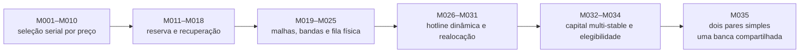

# Crypto Strategy Lab

Laboratório de pesquisa reproduzível para estratégias Spot de stablecoins, com foco em execução
causal, fila/FIFO, conservação de capital e auditoria econômica.

O projeto é **experimental**. Resultados históricos e diagnósticos de desenvolvimento não são
recomendação financeira, prova de rentabilidade futura ou autorização para operar dinheiro real.
O operador local possui um observador opcional de conta Binance em modo somente leitura, com
credenciais protegidas localmente por DPAPI. Não existe transporte para enviar ordens ou saques;
`TESTNET` e `LIVE` falham fechado.

## Estado atual

A linha mais recente é o **M035 Parallel Pair Capital Manager**: dois pares simples e independentes,
`USDCUSDT` e `FDUSDUSDT`, disputando uma única banca física de 200 USDT.

O teste V2 completo sorteou previamente a janela de 2026-02-01 01:00–04:00 UTC e executou dez
cenários: single/parallel × fees de 0, 1, 2, 5 e 10 bps por perna. Todos terminaram com:

- zero fills e zero ciclos;
- zero PnL e retorno de 0%;
- equity final marcada de 200 USDT;
- zero ciclos negativos, risk exits, dust ou inventário residual;
- conservação exata da banca e ownership único.

O paralelo elevou a utilização por reserva em F0 de 50,004% para 99,525%, sem produzir giro. Os
níveis admitidos não foram atingidos enquanto executáveis. Portanto, o mecanismo foi testado, mas
o M035 não demonstrou ganho de ciclos nem produtividade nessa janela. O `zero-loss` é verdadeiro
apenas de forma vazia, porque não houve execução.

- [Resultado M035 V2](docs/research/M035_RANDOM_3H_V2_RESULT.md)
- [Resumo JSON](reports/m035/M035_RANDOM_3H_V2_RESULT_SUMMARY.json)
- [Auditoria independente](reports/m035/M035_RANDOM_3H_V2_RESULT_AUDIT.json)
- [Estado canônico](docs/research/CURRENT_STATE.md)

## Como a pesquisa evoluiu

Os modelos não são versões de produto em produção. Cada `Mxxx` identifica uma hipótese ou mudança
experimental congelada. Resultados ruins, zeros, bloqueios de dados e invalidações técnicas são
preservados em vez de apagados ou ajustados retrospectivamente.

O [guia modelo por modelo](docs/MODEL_GUIDE.md) explica M001–M035, incluindo objetivo, mudança e
estado observado. Em alto nível:



## Diagramas e gráficos

O [índice visual](docs/VISUAL_INDEX.md) reúne:

- diagramas de causalidade, zero-loss, capital e cutoff do M034;
- arquitetura, isolamento dos pares e máquina de estados do capital do M035;
- curvas SVG de equity, capital operacional, reserva e notional dos experimentos M013–M015;
- dashboards HTML autocontidos, comparação de estratégias e simulador matemático da banca.

Exemplo — equity M014:


## Princípios de execução

- Decisões só podem usar eventos já recebidos; eventos futuros não alteram o passado.
- Fills físicos usam L2 e trades individuais, nunca candles como substituto.
- Volume próprio não entra no fluxo público e não existe self-fill.
- Cancelamento só libera capital após `CANCEL_ACK`.
- Dinheiro e quantidades usam aritmética decimal exata.
- Um ciclo positivo não compensa um ciclo negativo na classificação zero-loss.
- Inventário e dust permanecem pertencendo ao usuário e são marcados no cutoff.
- Uma banca compartilhada nunca pode reservar o mesmo capital em dois pares.

## Dados e proveniência

Arquivos públicos oficiais da Binance são validados contra seus checksums. Nos estudos L2 mais
recentes, Tardis reproduz mensagens nativas da Binance e Binance Vision vincula a população de
trades individuais. Toda mistura de fontes é declarada nos manifests e relatórios.

Os arquivos brutos grandes ficam fora do Git. O repositório publica código, protocolos, hashes,
relatórios e evidências compactas suficientes para explicar exatamente o que foi medido.

## Executar localmente

Requisitos principais: Python 3.12 e [`uv`](https://docs.astral.sh/uv/). PostgreSQL/TimescaleDB via
Docker é necessário apenas para fluxos que persistem no banco.

```powershell
uv sync --all-groups
uv run pytest -m "not integration"
uv run ruff check .
uv run ruff format --check .
uv run mypy
```

Para o smoke determinístico sem banco:

```powershell
uv run crypto-lab simulate-fixture --no-persist
```

Downloads históricos são explícitos e separados da execução experimental. Não execute campanhas
one-shot consumidas: consulte primeiro [CURRENT_STATE](docs/research/CURRENT_STATE.md), o journal e
o protocolo da identidade.

## Estrutura

- `src/crypto_strategy_lab/`: engines, ledgers, fila, dados, simulação e relatórios;
- `tests/`: testes unitários, adversariais e de invariantes;
- `docs/microstructure/`: especificações e diretivas experimentais;
- `docs/research/`: journals, estado atual e revisões;
- `reports/`: resultados, auditorias, gráficos e dashboards autocontidos;
- `scripts/`: runners e utilitários reproduzíveis.

## Limites

Nenhum resultado do projeto deve ser interpretado como OOS ou live quando o próprio artefato o
classifica como `DEVELOPMENT`, `NORMALIZED`, `PRICE_PATH_ONLY`, `INCONCLUSIVE` ou `REJECTED`.
Testes de software aprovados provam invariantes do código; não provam que uma estratégia ganha
dinheiro.

## Segurança

Não coloque chaves, tokens, dumps privados ou arquivos `.env` no repositório. Para o observador
opcional, use uma chave Binance restrita a leitura, sem permissão de trading ou saque. Consulte
[`docs/live/LIVE_ARCHITECTURE.md`](docs/live/LIVE_ARCHITECTURE.md) para os limites do operador.
