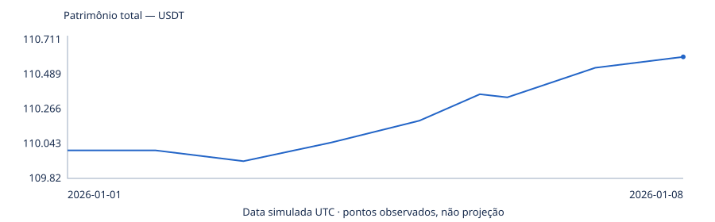
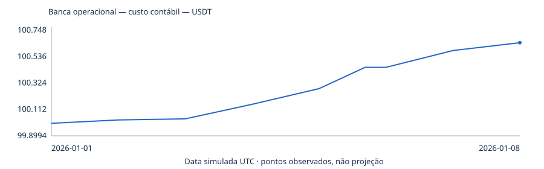
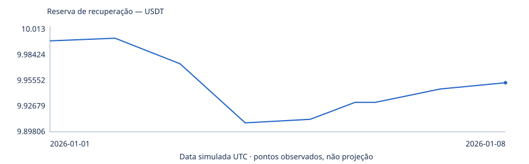
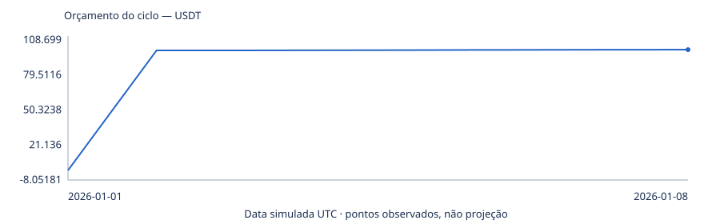

# Diagramas e gráficos

Os visuais abaixo já fazem parte da evidência versionada. Eles devem ser lidos com a classificação
do experimento correspondente: vários são diagnósticos normalizados, price-path ou desenvolvimento,
não resultados live.

## Diagramas de arquitetura e verificação

- [M034 — diagramas de verificação zero-loss](research/M034_ZERO_LOSS_DEV_BACKTEST_200USD_3H.md#verification-diagrams):
  fluxo do experimento, attribution por ciclo, capital no cutoff, owned-return e ordem dos gates.
- [M035 — arquitetura do capital compartilhado](microstructure/M035_PARALLEL_PAIR_CAPITAL_MANAGER.md#authority-topology):
  autoridade global, isolamento Pair A/B e DustLedger.
- [M035 — isolamento dos pares](microstructure/M035_PARALLEL_PAIR_CAPITAL_MANAGER.md#pair-state-isolation):
  cada par mantém hotline, grid, fila, inventário e PnL próprios.
- [M035 — máquina de estados do capital](microstructure/M035_PARALLEL_PAIR_CAPITAL_MANAGER.md#capital-state-machine):
  `FREE`, reserva, cancel pending, inventário, retorno e dust.
- [Captura forward dual-pair](research/M035_DUAL_PAIR_FORWARD_CAPTURE_PROTOCOL.md):
  captura pública simultânea e separação entre transporte e lógica econômica.

## Curvas M013

Também estão disponíveis as curvas por fila:
[Q1](../reports/usdcusdt/M013-q1.svg),
[Q2](../reports/usdcusdt/M013-q2.svg),
[Q3](../reports/usdcusdt/M013-q3.svg) e
[Q4](../reports/usdcusdt/M013-q4.svg).

## Curvas M014

## Curvas M015

## Relatórios HTML autocontidos

O GitHub mostra o código-fonte de HTML; baixe ou abra localmente para usar os controles interativos.

- [Simulador matemático da banca](../reports/usdcusdt/bank-growth-simulator.html) — exploração
  matemática, não backtest nem previsão.
- [Pesquisa de execução B10](../reports/usdcusdt/B10-execution-research.html) — fila, reserva e
  evidência física da campanha B10.
- [Comparação de estratégias](../reports/usdcusdt/strategy-comparison.html) — comparativo histórico
  das identidades documentadas.
- [Produtividade temporal](../reports/usdcusdt/temporal-productivity.html) — distribuição por
  horizonte e concentração temporal.
- [Dashboard de simulação](../reports/dashboard.html) e
  [dashboard original](../reports/dashboard-original.html) — relatórios offline sem CDN.
- [Dashboard de aprendizado](../reports/learning-dashboard.html) — resultados da linha ML histórica,
  separada da linha microstructure atual.
- [Scanner diário de níveis](../reports/microstructure/daily-level-scanner.html) — diagnóstico de
  ocupação de preços, não evidência de fill.

## Resultado visual mais recente

O M035 V2 teve zero ciclos em todos os braços; por isso não existe curva de PnL informativa para
desenhar. Os CSVs de capital e pares permanecem publicados para inspeção:

- [timeline global](../reports/m035/M035_RANDOM_3H_V2_CAPITAL_TIMELINE.csv)
- [timeline Pair A](../reports/m035/M035_RANDOM_3H_V2_PAIR_A_TIMELINE.csv)
- [timeline Pair B](../reports/m035/M035_RANDOM_3H_V2_PAIR_B_TIMELINE.csv)
- [lista de ciclos](../reports/m035/M035_RANDOM_3H_V2_CYCLES.csv) — somente cabeçalho, pois houve zero ciclos.
