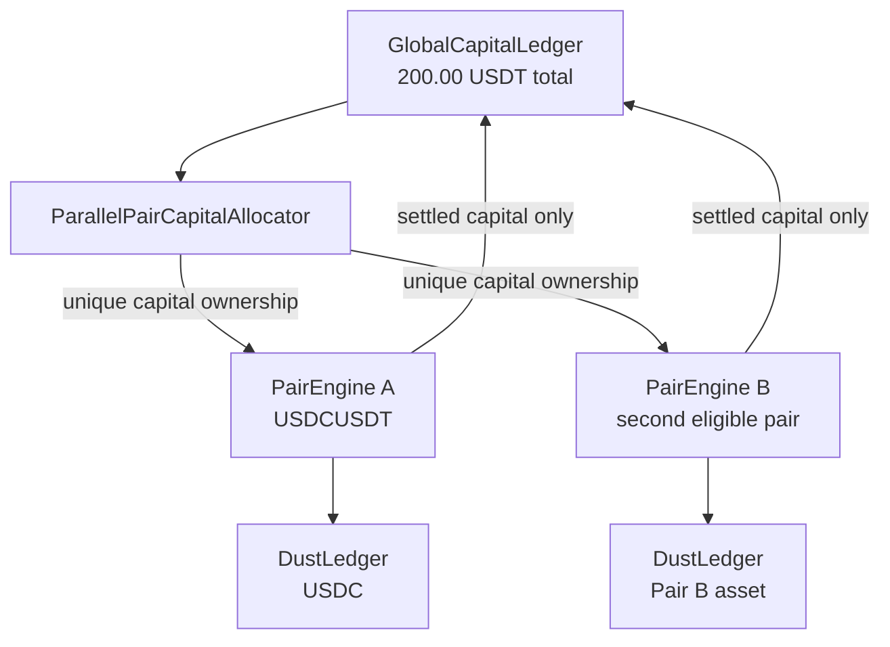
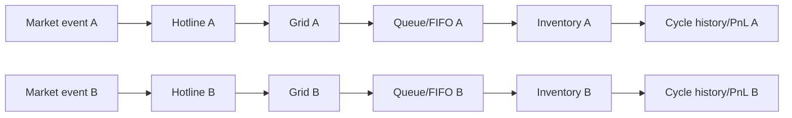
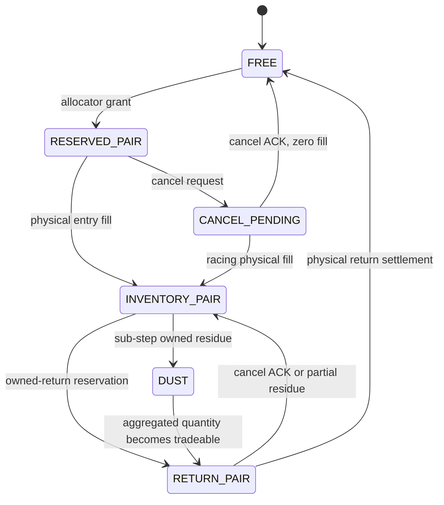

# M035 — Parallel Pair Capital Manager

Status: `ARCHITECTURE_MAP_FROZEN_PRE_IMPLEMENTATION`  
Identity: `M035_PARALLEL_PAIR_CAPITAL_MANAGER`  
Venue: `BINANCE_ONLY`  
Economic bank: `200.00 USDT TOTAL`, never per pair  
Normal route: `ORIGIN -> PAIR_ASSET -> ORIGIN`  

## Scope and scientific status

M035 tests whether two independent simple-pair engines can increase physical cycles per hour and
net PnL per capital-hour while sharing one physical bank. It is not a rollback to M029, a long
multi-stable route, a second venue, or a claim of live profitability. M029/M030 provide the proven
simple hotline/FIFO mechanics; M034 provides the accounting, causal execution and zero-loss
invariants.

This document freezes the architecture before implementation. The historical economic treatment
is currently blocked because the canonical inventory contains no second Binance pair with aligned
physical L2 and individual trades. Synthetic conformance remains authorized and is not an economic
result.

## M035_ARCHITECTURE_MAP

| Classification | Existing authority | M035 decision |
|---|---|---|
| REUSE | `SlotLedger` physical reservation/fill/cancel-ACK invariants | Reuse atomic lifecycle and exact Decimal accounting beneath one global authority; do not create one bank per pair. |
| REUSE | `CausalQueueEstimator` | Instantiate one estimator per pair. Preserve queue-ahead, FIFO cohorts, causal compatible-flow consumption, racing fills and cancel ACK. |
| REUSE | M030 hotline-first semantics | Preserve RETURN > HOT > MID > FAR > old zero-fill; zero-fill capital remains unavailable until cancel ACK. |
| REUSE | M034 zero-loss attribution and risk-exit rules | Keep individual cycle PnL, causal marks, no cross-subsidy and separately counted negative defensive exits. |
| REUSE | M034 Binance temporal rules, fees, data and market evidence gates | Apply independently to every pair at decision time. Unknown evidence may produce zero admission. |
| ADAPT | M029/M030 dynamic hotline and grid | Extract pair-scoped state. Every `PairEngine` owns its hotline, book, grid, orders, queue, inventory and event clock. |
| ADAPT | M030 reclaim decision | C1 replacement requires strict economic superiority over lost FIFO + cancel + re-entry costs. C2 remains mobile. |
| ADAPT | `AdaptiveColumnAllocator` / M034 productivity score | Rank simultaneous pair candidates through one `ParallelPairCapitalAllocator`; owned returns and risk obligations precede new entry. |
| ADAPT | M034 inventory close semantics | A tradeable returned quantity may close the ordinary lot while residual asset remains owned dust with its cost basis and source cycles. Dust is marked, never erased. |
| REMOVE_FROM_M035_PATH | `RouteEnumerator`, `RouteScorer` and 3–4-asset route lifecycle | M035 admits only two-leg cycles for each selected symbol. Historical code remains provenance. |
| REMOVE_FROM_M035_PATH | Kraken/M033 multi-venue path | Kraken stays retired before gate, ranking, capital, obligation and KPI computation. |
| REMOVE_FROM_M035_PATH | `FEE_DUST_PREVENTS_FULL_RETURN` and no-residue close gate | Dust is not a loss and cannot reject an otherwise eligible opportunity solely because of step-size residue. |
| REMOVE_FROM_M035_PATH | Fixed 100/100 pair quotas | Neither pair owns permanent capital. Allocation is opportunity-driven from the shared pool. |
| NEW | `GlobalCapitalLedger` | Sole authority for free, reserved, inventory, return, cancel-pending and dust ownership across both pairs; every `capital_id` has exactly one owner. |
| NEW | `PairState` / pair-scoped engine | Explicit isolated state and logs for `PAIR_A` and `PAIR_B`. |
| NEW | `DustLedger` | Per-asset exact lots: quantity, cost basis, marked value and source cycles; supports causal aggregation and later tradeable reuse. |
| NEW | `ParallelPairCapitalAllocator` | Deterministic simultaneous allocator enforcing priorities, marginal productivity and physical availability. |
| NEW | M035 conformance harness | A deterministic 10–15 minute logical scenario proving isolation, mobility, FIFO, shared-capital conservation, dust and zero-loss attribution before economic replay. |

## Authority topology



`GlobalCapitalLedger` is the single financial authority. Pair engines may request, reserve, consume
and return capital, but may not maintain an independent free-bank balance.

## Pair-state isolation



There is no arrow between the two pair-local chains. Shared information flows only through capital
candidates submitted to the global allocator and capital ownership events returned by the global
ledger.

## Capital state machine



At every event:

```text
FREE
+ RESERVED_PAIR_A + RESERVED_PAIR_B
+ INVENTORY_PAIR_A + INVENTORY_PAIR_B
+ RETURN_PAIR_A + RETURN_PAIR_B
+ CANCEL_PENDING
+ DUST_MARKED
= TOTAL_EQUITY
```

The same `capital_id` cannot occur in two live ownership buckets. A cancel request changes lifecycle
state but releases nothing. Only cancel ACK or a fully attributed physical settlement changes owner.

## Allocation order

For all candidates sharing a decision timestamp:

1. owned-return obligations;
2. causal risk/inventory obligations;
3. new entry ordered by positive marginal productivity;
4. FIFO value, expected lock, expected net edge and deterministic candidate ID as tie-breakers.

Allocation is bounded by currently free capital. A pair may receive zero or most of the bank. The
sum of grants can never exceed free capital or total marked equity.

## FIFO and moving-grid decision

C1 is persistent. A C1 order is replaced only when:

```text
Value(NewPosition) - Value(CurrentPosition)
> LostFIFOValue + CancelCost + ReentryCost
```

Equality preserves the old order. C2 may follow the hotline more aggressively, but its capital is
not reusable before cancel ACK. Multi-tick moves reconcile directly to the final causal hotline.

## Dust accounting

Dust remains an owned asset lot. It carries exact quantity, proportional cost basis, owner pair and
source cycle IDs. Its marked value participates in equity at the latest causal mark. Aggregation may
make a later quantity tradeable; consuming it uses deterministic FIFO lots and leaves an exact
residual. No rounding operation can delete value or relabel dust as realized loss.

An ordinary cycle is assessed on its own attributed proceeds and costs. Dust value is not secretly
credited as proceeds, and another cycle's profit cannot offset a negative cycle. Open dust remains
visible in marked equity and `DUST_BY_ASSET`.

## Conformance gate

The deterministic conformance run must pass all of:

- `HOTLINE_ISOLATION`
- `GRID_FOLLOWS_HOTLINE`
- `C1_FIFO_PRESERVATION`
- `C2_MOBILITY`
- `GLOBAL_CAPITAL_CONSERVATION`
- `NO_DOUBLE_CAPITAL`
- `OWNED_RETURN_PRIORITY`
- `DUST_ACCOUNTING`
- `ZERO_LOSS_ATTRIBUTION`
- `CANCEL_ACK`
- `NO_SELF_FILL`
- `NO_FUTURE_DATA`

Failure blocks the economic run.

## Historical data gate

The canonical inventory at architecture freeze reports:

- `USDCUSDT`: physical L2 + individual public trades available;
- `FDUSDUSDT`: no eligible local L2/trades unit;
- every other candidate Pair B: zero eligible local units;
- aligned two-pair windows: zero.

Source authorities:

- `reports/usdcusdt/M034-pair-universe.json`
- `reports/usdcusdt/M034_BINANCE_DATASET_MANIFEST.json`
- `docs/research/M034_BINANCE_EVIDENCE_PACK.md`

Therefore the current economic status is:

```text
MULTI_PAIR_HISTORICAL_TEST_BLOCKED_BY_PAIR_B_DATA
```

M035 must not substitute candles, aggregate trades, a favorable window, another venue or synthetic
fills. A dual-pair forward capture may be prepared as a new evidence-acquisition protocol, but no
capture/replay is implied by this architecture freeze.

## Required delivery order

1. freeze this architecture map;
2. implement the canonical M035 authorities and conformance tests;
3. pass regressions and source-bound independent review;
4. publish the conformance artifacts;
5. run the economic comparison only after an aligned Pair B physical tape exists and its experiment
   manifest/config are frozen before the first event.

`CONFORMANCE_PASS != ECONOMIC_RESULT != STRATEGY_PASS`.

## Post-freeze evidence update — 2026-09-12

The OWNER subsequently authorized safe public Binance/Tardis acquisition with explicit mixed-source
reporting. Exactly 21 frozen first-of-month `FDUSDUSDT` days were acquired: normalized Binance Spot
L2 through Tardis and official Binance Vision individual-trade archives with adjacent checksums.
See `reports/m035/M035_FDUSDUSDT_21_DAY_DATA_REPORT.json`.

This resolves raw Pair B source absence, but does not retroactively alter the architecture freeze or
authorize replay. Native `U/u` continuity, aligned Pair A/B coverage and the randomly drawn,
preregistered three-hour window remain pre-economic gates.
