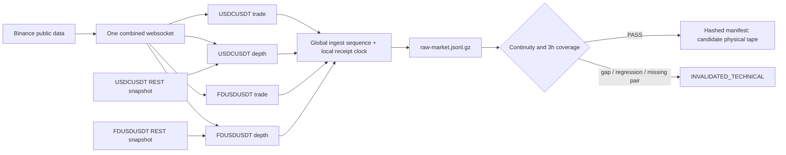

# M035 dual-pair forward capture protocol

Status: `PREPARED_NOT_STARTED`  
Identity: `M035_DUAL_PAIR_FORWARD_CAPTURE_V1`  
Purpose: close the Pair B physical-data gate without consuming the M034 one-shot campaign.

## Frozen scope

- venue: Binance public market-data endpoints only;
- pairs: `USDCUSDT` and `FDUSDUSDT` on the same connection and receipt clock;
- evidence: individual `@trade` plus `@depth@100ms` with a REST L2 snapshot per pair;
- duration: the first complete 10,800-second window after both pair books bridge their snapshots
  and both pairs produce an individual trade;
- selection: the first published-source attempt; PnL is never inspected to select a window;
- output: append-only compressed raw messages, exchange rules, snapshots, result and SHA-256
  manifest;
- exclusions: `aggTrade`, candles, account endpoints, orders, fills, paper trading, capital and Kraken.

Frozen configuration SHA-256:
`105d7a704a45213ccaf6083fd023a4d216e226db20429d7a032594d04e6a7cd9`.

## Evidence flow



The four logical channels remain symbol-scoped, while `ingest_sequence` records the exact order in
which the single connection delivered them. Messages are never sorted by exchange timestamp.

## Causal validation

For each pair independently:

1. subscribe before requesting the snapshot so websocket messages can buffer;
2. initialize `LocalDepth` from `lastUpdateId`;
3. ignore only depth diffs already covered by the snapshot;
4. require the first applicable diff to bridge `lastUpdateId + 1`;
5. require every later diff to cover the next update ID;
6. require strictly consecutive individual trade IDs;
7. reject timestamp regression within each event stream;
8. require every pair/type channel to remain causally fresh within a frozen 10-second maximum;
9. invalidate the capture on any gap, malformed event, unexpected symbol/type or global silence.

The economic window starts only after both books are valid and both pairs have emitted an
individual trade. Its end is monotonic-time based and exclusive. The first wire event received at
or beyond the cutoff is retained in raw ingress but is never parsed into or applied to the validated
window. Final acceptance requires at least one depth update and one trade from each pair inside the
window.

## Publication and execution gate

The runner refuses to start unless:

- the provided source SHA equals both local `HEAD` and `origin/main`;
- the capture source closure is clean;
- the output directory does not already exist;
- the output remains inside this repository.

The current environment cannot write `.git` or reach GitHub, so these conditions are not met.
Consequently no websocket was opened and no capture was started. After publication, the prepared
command is:

```powershell
uv run python scripts/run_m035_dual_pair_capture.py `
  --source-sha <PUBLISHED_SHA> `
  --output reports/m035/captures/M035_DUAL_PAIR_FORWARD_CAPTURE_V1
```

If the capture completes, a separate validator must confirm the manifest hashes, exact window,
per-pair continuity and exchange-rule sufficiency before the tape can be registered as DEVELOPMENT
evidence. Only then may the M035 economic replay be preregistered. Capture completion itself is not
an economic or strategy PASS.
