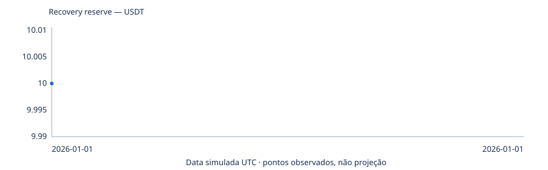
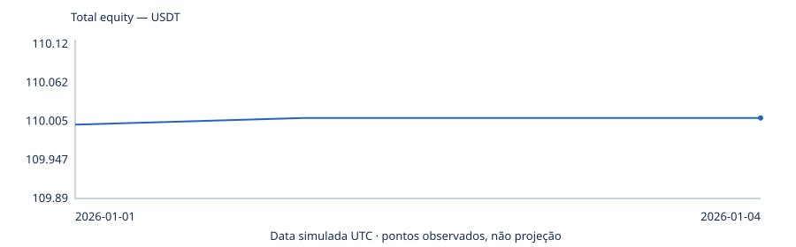
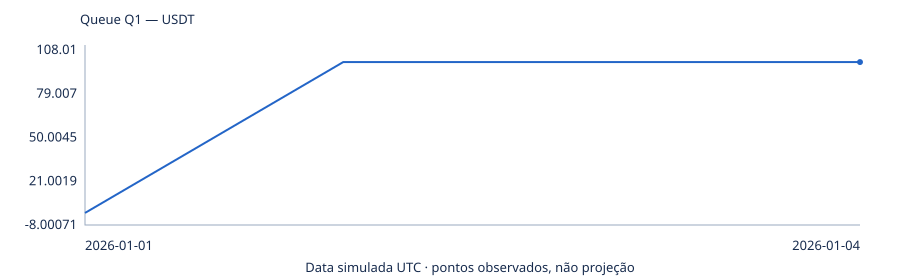
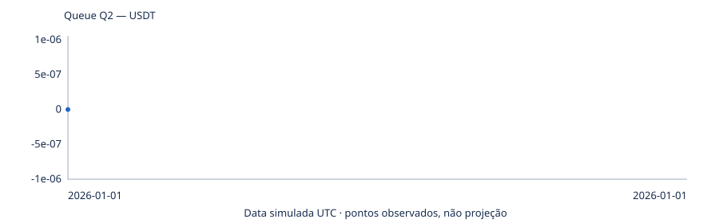
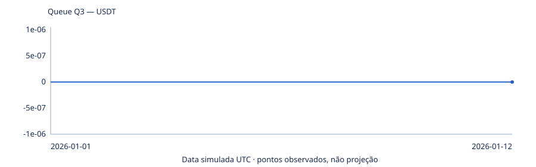

# M013 CONTINUOUS MULTI-QUEUE — STAGE_1

## PROGRESSO

RUN_ID=e73ab0814cd5fd82fc3a459e9e59c83435ff2c0e4f2cd4909f644ea485dfbe65; STAGE=STAGE_1; RUN_STATUS=RUNNING.

## RESULTADO ECONÔMICO PARCIAL

Composição contínua. Cinco meses; extensão condicionada a PASS_TO_EXTENSION.

| Mês fechado | Banca operacional USDT | Reserva USDT | Patrimônio USDT | Ciclos do mês | Releases |
|---|---:|---:|---:|---:|---:|
| Nenhum mês concluído | — | — | — | — | — |

Ciclos do mês = ciclos ordinários completos operacionais + Q4, sem somar releases. Saldos de fechamento, sem reset; mês ainda aberto não é projetado. Valores visuais arredondados; JSON preserva precisão integral.

Placar atual:

| Métrica atual | Valor |
|---|---|
| OPERATING_CAPITAL | 100 |
| RECOVERY_RESERVE | 10 |
| RESERVE_RATIO | 0.1 |
| CORE_RESERVE | 10 |
| ACTIVE_RESERVE_CAPITAL | 0 |
| TOTAL_EQUITY | 110 |
| TOTAL_PROFIT | 0 |
| OPERATING_QUEUES_ACTIVE | 0 |
| RESERVE_QUEUE_ACTIVE | False |
| CYCLES | 0 |
| NET_POSITIVE_CYCLES | 0 |
| MOTOR_UPTIME | UNAVAILABLE |
| CAPITAL_WEIGHTED_UPTIME | UNAVAILABLE |
| FULL_STOP_HOURS | 0 |
| ZERO_CYCLE_DAYS | 0 |
| MAX_HOLD | 0 |
| LOCK_HOURS_GT24 | 0 |
| HARD_LOCK_VIOLATIONS | 0 |
| RELEASE_COUNT | 0 |
| TOTAL_RELEASE_LOSS | 0 |
| RESERVE_CONTRIBUTIONS | 0 |
| ACTIVE_RESERVE_PROFIT | 0 |
| RESERVE_CONSUMPTION | 0 |
| RESERVE_SELF_SUSTAINABILITY_RATIO | UNAVAILABLE |
| CAPACITY_PRESSURE_EVENTS | 0 |
| VERDICT | PENDING |

Marcos observados:

| Métrica | DAY_1 | DAY_7 | DAY_30 | DAY_60 | DAY_90 | DAY_120 | FINAL_5_MONTH |
|---|---|---|---|---|---|---|---|
| OPERATING_CAPITAL | UNAVAILABLE | UNAVAILABLE | UNAVAILABLE | UNAVAILABLE | UNAVAILABLE | UNAVAILABLE | UNAVAILABLE |
| RECOVERY_RESERVE | UNAVAILABLE | UNAVAILABLE | UNAVAILABLE | UNAVAILABLE | UNAVAILABLE | UNAVAILABLE | UNAVAILABLE |
| RESERVE_RATIO | UNAVAILABLE | UNAVAILABLE | UNAVAILABLE | UNAVAILABLE | UNAVAILABLE | UNAVAILABLE | UNAVAILABLE |
| CORE_RESERVE | UNAVAILABLE | UNAVAILABLE | UNAVAILABLE | UNAVAILABLE | UNAVAILABLE | UNAVAILABLE | UNAVAILABLE |
| ACTIVE_RESERVE_CAPITAL | UNAVAILABLE | UNAVAILABLE | UNAVAILABLE | UNAVAILABLE | UNAVAILABLE | UNAVAILABLE | UNAVAILABLE |
| TOTAL_EQUITY | UNAVAILABLE | UNAVAILABLE | UNAVAILABLE | UNAVAILABLE | UNAVAILABLE | UNAVAILABLE | UNAVAILABLE |
| TOTAL_PROFIT | UNAVAILABLE | UNAVAILABLE | UNAVAILABLE | UNAVAILABLE | UNAVAILABLE | UNAVAILABLE | UNAVAILABLE |
| OPERATING_QUEUES_ACTIVE | UNAVAILABLE | UNAVAILABLE | UNAVAILABLE | UNAVAILABLE | UNAVAILABLE | UNAVAILABLE | UNAVAILABLE |
| RESERVE_QUEUE_ACTIVE | UNAVAILABLE | UNAVAILABLE | UNAVAILABLE | UNAVAILABLE | UNAVAILABLE | UNAVAILABLE | UNAVAILABLE |
| CYCLES | UNAVAILABLE | UNAVAILABLE | UNAVAILABLE | UNAVAILABLE | UNAVAILABLE | UNAVAILABLE | UNAVAILABLE |
| NET_POSITIVE_CYCLES | UNAVAILABLE | UNAVAILABLE | UNAVAILABLE | UNAVAILABLE | UNAVAILABLE | UNAVAILABLE | UNAVAILABLE |
| MOTOR_UPTIME | UNAVAILABLE | UNAVAILABLE | UNAVAILABLE | UNAVAILABLE | UNAVAILABLE | UNAVAILABLE | UNAVAILABLE |
| CAPITAL_WEIGHTED_UPTIME | UNAVAILABLE | UNAVAILABLE | UNAVAILABLE | UNAVAILABLE | UNAVAILABLE | UNAVAILABLE | UNAVAILABLE |
| FULL_STOP_HOURS | UNAVAILABLE | UNAVAILABLE | UNAVAILABLE | UNAVAILABLE | UNAVAILABLE | UNAVAILABLE | UNAVAILABLE |
| ZERO_CYCLE_DAYS | UNAVAILABLE | UNAVAILABLE | UNAVAILABLE | UNAVAILABLE | UNAVAILABLE | UNAVAILABLE | UNAVAILABLE |
| MAX_HOLD | UNAVAILABLE | UNAVAILABLE | UNAVAILABLE | UNAVAILABLE | UNAVAILABLE | UNAVAILABLE | UNAVAILABLE |
| LOCK_HOURS_GT24 | UNAVAILABLE | UNAVAILABLE | UNAVAILABLE | UNAVAILABLE | UNAVAILABLE | UNAVAILABLE | UNAVAILABLE |
| HARD_LOCK_VIOLATIONS | UNAVAILABLE | UNAVAILABLE | UNAVAILABLE | UNAVAILABLE | UNAVAILABLE | UNAVAILABLE | UNAVAILABLE |
| RELEASE_COUNT | UNAVAILABLE | UNAVAILABLE | UNAVAILABLE | UNAVAILABLE | UNAVAILABLE | UNAVAILABLE | UNAVAILABLE |
| TOTAL_RELEASE_LOSS | UNAVAILABLE | UNAVAILABLE | UNAVAILABLE | UNAVAILABLE | UNAVAILABLE | UNAVAILABLE | UNAVAILABLE |
| RESERVE_CONTRIBUTIONS | UNAVAILABLE | UNAVAILABLE | UNAVAILABLE | UNAVAILABLE | UNAVAILABLE | UNAVAILABLE | UNAVAILABLE |
| ACTIVE_RESERVE_PROFIT | UNAVAILABLE | UNAVAILABLE | UNAVAILABLE | UNAVAILABLE | UNAVAILABLE | UNAVAILABLE | UNAVAILABLE |
| RESERVE_CONSUMPTION | UNAVAILABLE | UNAVAILABLE | UNAVAILABLE | UNAVAILABLE | UNAVAILABLE | UNAVAILABLE | UNAVAILABLE |
| RESERVE_SELF_SUSTAINABILITY_RATIO | UNAVAILABLE | UNAVAILABLE | UNAVAILABLE | UNAVAILABLE | UNAVAILABLE | UNAVAILABLE | UNAVAILABLE |
| CAPACITY_PRESSURE_EVENTS | UNAVAILABLE | UNAVAILABLE | UNAVAILABLE | UNAVAILABLE | UNAVAILABLE | UNAVAILABLE | UNAVAILABLE |
| VERDICT | UNAVAILABLE | UNAVAILABLE | UNAVAILABLE | UNAVAILABLE | UNAVAILABLE | UNAVAILABLE | UNAVAILABLE |

Checkpoint summary:

| Checkpoint | Total equity | Operating capital | Reserve | Cycles | Verdict |
|---|---:|---:|---:|---:|---|
| DAY_1 | None | None | None | None | None |
| DAY_7 | None | None | None | None | None |
| DAY_30 | None | None | None | None | None |
| DAY_60 | None | None | None | None | None |
| DAY_90 | None | None | None | None | None |
| DAY_120 | None | None | None | None | None |
| FINAL_5_MONTH | None | None | None | None | None |

## TESTES DO SOFTWARE

TESTS_PASSED=null; TESTS_FAILED=null; INDEPENDENT_AUDIT=PENDING.

## RESULTADO FINAL

PENDING. Nenhum PASS é derivado sem auditoria independente e gates do runner.

Evidence-only curves:

Missing fields remain null/UNAVAILABLE.
