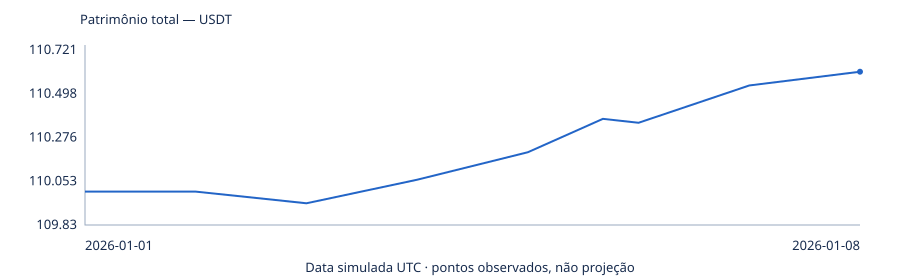
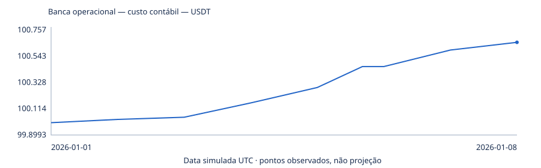
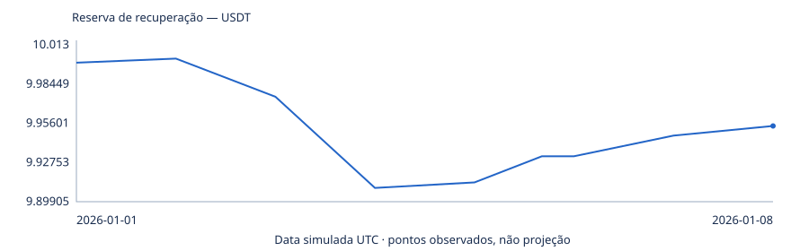
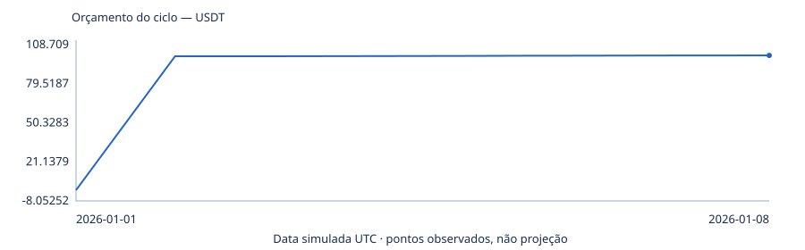

# M015 — B10 F2.5 com reserva reforçada

Primeira semana somente · 100 USDT operacionais + 10 de reserva · COMPOUNDING · 10% dos lucros positivos para a reserva.

**73 ciclos completos, 3 releases; patrimônio 110.610600 USDT.** Banca operacional é caixa + custo do inventário; patrimônio marca o inventário ao preço de venda observado. Por isso banca + reserva pode diferir do patrimônio durante uma posição aberta.

| Métrica | Valor |
|---|---|
| SIMULATION_TIMESTAMP | 2026-01-08T00:00:00+00:00 |
| RUN_STATUS | COMPLETE |
| OPERATING_BANK | 100.65655 |
| RESERVE | 9.95405 |
| TOTAL_EQUITY | 110.6106 |
| FULL_FILL_CYCLES | 73 |
| NET_POSITIVE_CYCLES | 73 |
| NET_REALIZED_PNL | 0.6106 |
| TOTAL_FEES_QUOTE | 0 |
| RESERVE_FUNDING | 0.07295 |
| RESERVE_CONSUMPTION | 0.1189 |
| MIN_RESERVE | 9.89605 |
| RELEASE_FILLED | 3 |
| ZERO_CYCLE_DAYS | 0 |
| MAX_HOLD_HOURS | 17.873193 |
| HOLDS_OVER_24H | 0 |
| FLAT_HOURS | 86.810932 |
| HOLDING_HOURS | 81.189068 |
| WORKING_ORDER_HOURS | 167.99709 |
| MAX_DRAWDOWN_PCT | 0.089976 |
| EXTENSION_STATUS | AWAITING_MINIMUM_AND_AUDIT_GATE |

## Fechamentos diários

| Dia UTC | Banca USDT | Reserva USDT | Patrimônio USDT | Ciclos completos | Positivos | Releases |
|---|---:|---:|---:|---:|---:|---:|
| 2026-01-01 | 100.026730 | 10.002970 | 110.000000 | 3 | 3 | 0 |
| 2026-01-02 | 100.044550 | 9.975250 | 109.940600 | 2 | 2 | 1 |
| 2026-01-03 | 100.161550 | 9.909050 | 110.060600 | 13 | 13 | 1 |
| 2026-01-04 | 100.287550 | 9.913050 | 110.200600 | 14 | 14 | 1 |
| 2026-01-05 | 100.458550 | 9.932050 | 110.350600 | 19 | 19 | 0 |
| 2026-01-06 | 100.593550 | 9.947050 | 110.540600 | 15 | 15 | 0 |
| 2026-01-07 | 100.656550 | 9.954050 | 110.610600 | 7 | 7 | 0 |

Meta de 2.000 ciclos positivos: 0 de 7 dias fechados. Releases não entram na meta.

O resultado é condicional às hipóteses de execução; não é uma operação real. Próxima semana condicionada a500/dia e auditoria; verificar gate abaixo.

[Diagnóstico dos gargalos e comparação com B10](M015-week1-autopsy.md).

Meta mínima de 500 ciclos positivos: 0 de 7 dias. Meta aspiracional: 2000. GATE_TO_WEEK_2=False.

Hipótese: prioridade de preço contrafactual; clearance da fila não foi observado em L2 histórico. Quantidades próprias continuam limitadas ao fluxo bruto.

## Curvas de capital

Valores observados no replay condicional; não são projeções.

## Testes do software

{"tests_passed": 125, "tests_failed": 0, "TEST_SUITE_PASS_IS_STRATEGY_PASS": false, "independent_audit_samples": 73}

TEST_SUITE_PASS != STRATEGY_PASS. Auditoria independente do replay: PASS_CONDITIONAL.

## Resultado final

MINIMUM_500_NOT_MET; WEEK_2_BLOCKED. Custos/L2 históricos incompletos; perfil parametrizado condicional, não promessa de crescimento real.
